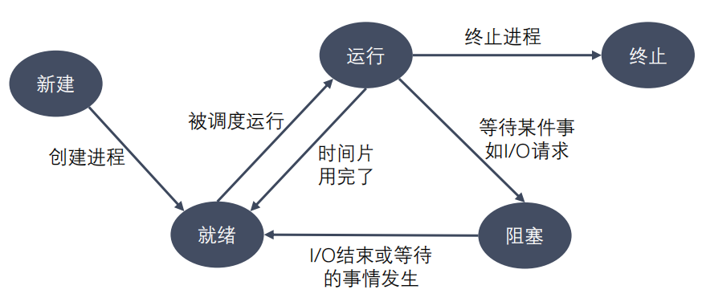

# Notes of Process

## 程序和进程

**程序**是包含一系列信息的文件，这些信息描述了如何在运行时创建一个进程：

**进程是正在运行的程序的实例**。是一个具有一定独立功能的程序关于某个数据集合的一次运行活动。它是操作系统动态执行的基本单元，在传统的操作系统中，进程既是基本的分配单元，也是基本的执行单元。

可以用一个程序来创建多个进程，进程是由内核定义的抽象实体，并为该实体分配用以执行程序的各项系统资源。

### 进程控制块

为了管理进程，内核必须对每个进程所做的事情进行清楚的描述。内核为每个进程分配一个 `PCB`(Processing Control Block)进程控制块，维护进程相关的信息，Linux 内核的进程控制块是 `task_struct` 结构体。

- 进程id：系统中每个进程有唯一的 id，用 pid_t 类型表示，其实就是一个非负整数
- 进程的状态：有就绪、运行、挂起、停止等状态
- 进程切换时需要保存和恢复的一些CPU寄存器
- 描述虚拟地址空间的信息
- 描述控制终端的信息
- 当前工作目录（Current Working Directory）
- umask 掩码
- 文件描述符表，包含很多指向 file 结构体的指针
- 和信号相关的信息
- 用户 id 和组 id
- 会话（Session）和进程组
- 进程可以使用的资源上限（Resource Limit）

### 进程的状态

进程状态反映进程执行过程的变化。这些状态随着进程的执行和外界条件的变化而转换。
在三态模型中，进程状态分为三个基本状态，即就绪态，运行态，阻塞态。在五态模型
中，进程分为新建态、就绪态，运行态，阻塞态，终止态。

- 运行态：进程占有处理器正在运行
- 就绪态：进程具备运行条件，等待系统分配处理器以便运行。当进程已分配到除CPU以外的所有必要资源后，只要再获得CPU，便可立即执行。在一个系统中处于就绪状态的进程可能有多个，通常将它们排成一个队列，称为就绪队列
- 阻塞态：又称为等待(wait)态或睡眠(sleep)态，指进程不具备运行条件，正在等待某个事件的完成

<div align="center"></div>

- 新建态：进程刚被创建时的状态，尚未进入就绪队列
- 终止态：进程完成任务到达正常结束点，或出现无法克服的错误而异常终止，或被操作系统及有终止权的进程所终止时所处的状态。进入终止态的进程以后不再执行，但依然保留在操作系统中等待善后。一旦其他进程完成了对终止态进程的信息抽取之后，操作系统将删除该进程。

<div align="center"></div>

## 进程相关命令

### 查看进程 `ps aux / ajx`

```txt
    a：     显示终端上的所有进程，包括其他用户的进程
    u：     显示进程的详细信息
    x：     显示没有控制终端的进程
    j：     列出与作业控制相关的信息
```

STAT参数意义：

```txt
    D       不可中断 Uninterruptible（usually IO）
    R       正在运行，或在队列中的进程
    S(大写) 处于休眠状态
    T       停止或被追踪
    Z       僵尸进程
    W       进入内存交换（从内核2.6开始无效）
    X       死掉的进程
    <       高优先级
    N       低优先级
    s       包含子进程
    +       位于前台的进程组
```

### 实时显示进程动态 `top`

可以在使用 `top` 命令时加上 `-d` 来指定显示信息更新的时间间隔，在 `top` 命令执行后，可以按以下按键对显示的结果进行排序：

```txt
    M       根据内存使用量排序
    P       根据 CPU 占有率排序
    T       根据进程运行时间长短排序
    U       根据用户名来筛选进程
    K       输入指定的 PID 杀死进程
```

### 杀死进程 `kill`

```txt
    kill [-signal] pid
    kill –l             列出所有信号
    kill –SIGKILL 进程ID
    kill -9 进程ID       同上
    killall name        根据进程名杀死进程
```

### 进程的创建 `fork()`

`pid_t fork(void);`

函数的作用：用于创建子进程。
返回值：

- fork()的返回值会返回两次。一次是在父进程中，一次是在子进程中。
- 在父进程中返回创建的子进程的ID,
- 在子进程中返回 0
- 如何区分父进程和子进程：通过 `fork` 的返回值。
- 在父进程中返回 -1，表示创建子进程失败，并且设置 `errno`

父子进程之间的关系：

区别：

1. fork()函数的返回值不同
   - 父进程中: > 0 返回的子进程的 ID
   - 子进程中: = 0
2. pcb中的一些数据
   - 当前的进程的id `pid`
   - 当前的进程的父进程的id `ppid`
   - 信号集

共同点：

某些状态下：子进程刚被创建出来，还没有执行任何的写数据的操作

- 用户区的数据
- 文件描述符表

父子进程对变量是不是共享的？

- 刚开始的时候，是一样的，共享的。如果修改了数据，不共享了。
- 读时共享（子进程被创建，两个进程没有做任何的写的操作），写时拷贝。

实际上，更准确来说，Linux 的 fork() 使用是通过**写时拷贝** (copy- on-write) 实现。写时拷贝是一种可以推迟甚至避免拷贝数据的技术。

内核此时并不复制整个进程的地址空间，而是让父子进程共享同一个地址空间。只用在需要写入的时候才会复制地址空间，从而使各个进行拥有各自的地址空间。也就是说，资源的复制是在需要写入的时候才会进行，在此之前，只有以只读方式共享。

fork之后父子进程共享文件，fork产生的子进程与父进程相同的文件文件描述符指向相同的文件表，引用计数增加，共享文件偏移指针。

### GDB多进程调试

使用 GDB 调试的时候，GDB 默认只能跟踪一个进程，可以在 `fork` 函数调用之前，通过指令设置 GDB 调试工具跟踪父进程或者是跟踪子进程，默认跟踪父进程。

设置调试父进程或者子进程：`set follow-fork-mode [parent（默认）| child]`

设置调试模式：`set detach-on-fork [on | off]`

默认为 `on`，表示调试当前进程的时候，其它的进程继续运行，如果为 `off`，调试当前进
程的时候，其它进程被 GDB 挂起。

查看调试的进程：`info inferiors`
切换当前调试的进程：`inferior id`
使进程脱离 GDB 调试：`detach inferiors id`

### `exec` 函数族

`exec` 函数族的作用是根据指定的文件名找到可执行文件，并用它来取代调用进程的
内容，换句话说，就是在调用进程内部执行一个可执行文件。

`exec` 函数族的函数执行成功后不会返回，因为调用进程的实体，包括**代码段**，**数据段**和**堆栈**等都已经被新的内容取代，只留下**进程 ID** 等一些表面上的信息仍保持原样，颇有些神似“三十六计”中的“金蝉脱壳”。看上去还是旧的躯壳，却已经注入了新的灵魂。只有调用失败了，它们才会返回 -1，从原程序的调用点接着往下执行。

```cpp
int execl(const char *path, const char *arg, .../* (char *) NULL */);
int execlp(const char *file, const char *arg, ... /* (char *) NULL */);
int execle(const char *path, const char *arg, .../*, (char *) NULL, char * const envp[] */);
int execv(const char *path, char *const argv[]);
int execvp(const char *file, char *const argv[]);
int execvpe(const char *file, char *const argv[], char *const envp[]);
int execve(const char *filename, char *const argv[], char *const envp[]);
```

- `l(list)` 参数地址列表，以空指针结尾
- `v(vector)` 存有各参数地址的指针数组的地址
- `p(path)` 按 `PATH` 环境变量指定的目录搜索可执行文件
- `e(environment)` 存有环境变量字符串地址的指针数组的地址

## 进程控制

### 进程退出

<div align="center"></div>

### 孤儿进程

- 父进程运行结束，但子进程还在运行（未运行结束），这样的子进程就称为孤儿进程（Orphan Process）。
- 每当出现一个孤儿进程的时候，内核就把孤儿进程的父进程设置为 `init` ，而 `init` 进程会循环地 `wait()` 它的已经退出的子进程。这样，当一个孤儿进程凄凉地结束了其生命周期的时候，`init` 进程就会代表党和政府出面处理它的一切善后工作。
- 因此孤儿进程并不会有什么危害。

### 僵尸进程

- 每个进程结束之后, 都会释放自己地址空间中的用户区数据，内核区的 `PCB` 没有办法自己释放掉，需要父进程去释放。
- 进程终止时，父进程尚未回收，子进程残留资源（PCB）存放于内核中，变成僵尸（Zombie）进程。
- 僵尸进程不能被 `kill -9` 杀死，这样就会导致一个问题，如果父进程不调用 `wait()` 或 `waitpid()` 的话，那么保留的那段信息就不会释放，其进程号就会一直被占用，但是系统所能使用的进程号是有限的，如果大量的产生僵尸进程，将因为没有可用的进程号而导致系统不能产生新的进程，此即为僵尸进程的危害，应当避免。

### 进程回收

- 在每个进程退出的时候，内核释放该进程所有的资源、包括打开的文件、占用的内存等。但是仍然为其保留一定的信息，这些信息主要主要指进程控制块 `PCB` 的信息（包括进程号、退出状态、运行时间等）。
- 父进程可以通过调用 `wait` 或 `waitpid` 得到它的退出状态同时彻底清除掉这个进程。
- `wait()` 和 `waitpid()` 函数的功能一样，区别在于，`wait()` 函数会阻塞， `waitpid()` 可以设置不阻塞，`waitpid()` 还可以指定等待哪个子进程结束。
- 注意：一次 `wait` 或 `waitpid` 调用只能清理一个子进程，清理多个子进程应使用循环。

### 退出信息相关宏函数

- `WIFEXITED(status)` 非0，进程正常退出

- `WEXITSTATUS(status)` 如果上宏为真，获取进程退出的状态（`exit` 的参数）

- `WIFSIGNALED(status)` 非0，进程异常终止

- `WTERMSIG(status)` 如果上宏为真，获取使进程终止的信号编号

- `WIFSTOPPED(status)` 非0，进程处于暂停状态

- `WSTOPSIG(status)` 如果上宏为真，获取使进程暂停的信号的编号

- `WIFCONTINUED(status)` 非0，进程暂停后已经继续运行

## 进程间通信

进程是一个独立的资源分配单元，不同进程（这里所说的进程通常指的是用户进程）之间
的资源是独立的，没有关联，不能在一个进程中直接访问另一个进程的资源。
但是，进程不是孤立的，不同的进程需要进行信息的交互和状态的传递等，因此需要进程
间通信( IPC：Inter Processes Communication )。

进程间通信的目的：

- 数据传输：一个进程需要将它的数据发送给另一个进程。
- 通知事件：一个进程需要向另一个或一组进程发送消息，通知它（它们）发生了某种
事件（如进程终止时要通知父进程）。
- 资源共享：多个进程之间共享同样的资源。为了做到这一点，需要内核提供互斥和同
步机制。
- 进程控制：有些进程希望完全控制另一个进程的执行（如 Debug 进程），此时控制
进程希望能够拦截另一个进程的所有陷入和异常，并能够及时知道它的状态改变。

### 进程通信的方式（必记）

<div align="center"></div>

### 匿名管道

管道也叫匿名管道，它是是 UNIX 系统 IPC（进程间通信）的最古老形式，所有的 UNIX 系统都支持这种通信机制。

#### 管道的特点

- 管道其实是一个在**内核内存中维护的缓冲器**，这个缓冲器的存储能力是有限的，不同的操作系统大小不一定相同。
- 管道拥有文件的特质：读操作、写操作，匿名管道没有文件实体，有名管道有文件实体，但不存储数据。可以按照操作文件的方式对管道进行操作。
- 一个管道是一个字节流，使用管道时不存在消息或者消息边界的概念，从管道读取数据的进程可以读取任意大小的数据块，而不管写入进程写入管道的数据块的大小是多少。
- 通过管道传递的数据是顺序的，从管道中读取出来的字节的顺序和它们被写入管道的顺序是完全一样的。
- 在管道中的数据的传递方向是单向的，一端用于写入，一端用于读取，管道是**半双工**的。
- 从管道读数据是一次性操作，数据一旦被读走，它就从管道中被抛弃，释放空间以便写更多的数据，在管道中无法使用 lseek() 来随机的访问数据。
- 匿名管道只能在具有公共祖先的进程（父进程与子进程，或者两个兄弟进程，具有亲缘关系）之间使用。

实现管道通信案例（实现 ps aux | grep xxx 父子进程间通信: [ipc.c](./ipc.c)）

#### 管道的读写特点

使用管道时，需要注意以下几种特殊的情况（假设都是阻塞I/O操作）

1. 所有的指向管道写端的文件描述符都关闭了（管道写端引用计数为0），有进程从管道的读端读数据，那么管道中剩余的数据被读取以后，再次read会返回0，就像读到文件末尾一样。

2. 如果有指向管道写端的文件描述符没有关闭（管道的写端引用计数大于0），而持有管道写端进程也没有往管道中写数据，这个时候有进程从管道中读取数据，那么管道中剩余的数据被读取后，再次read会阻塞，直到管道中有数据可以读了才读取数据并返回。

3. 如果所有指向管道读端的文件描述符都关闭了（管道的读端引用计数为0），这个时候有进程向管道中写数据，那么该进程会收到一个信号SIGPIPE, 通常会导致进程异常终止。

4. 如果有指向管道读端的文件描述符没有关闭（管道的读端引用计数大于0），而持有管道读端的进程也没有从管道中读数据，这时有进程向管道中写数据，那么在管道被写满的时候再次write会阻塞，直到管道中有空位置才能再次写入数据并返回。

总结：

读管道：

- 管道中有数据，read返回实际读到的字节数。
- 管道中无数据：
  - 写端被全部关闭，read返回0（相当于读到文件的末尾）
  - 写端没有完全关闭，read阻塞等待

写管道：

- 管道读端全部被关闭，进程异常终止（进程收到SIGPIPE信号）
- 管道读端没有全部关闭：
  - 管道已满，write阻塞
  - 管道没有满，write将数据写入，并返回实际写入的字节数

```cpp
/*
    设置管道非阻塞
    int flags = fcntl(fd[0], F_GETFL);  // 获取原来的flag
    flags |= O_NONBLOCK;            // 修改flag的值
    fcntl(fd[0], F_SETFL, flags);   // 设置新的flag
*/
```

### 命名管道

匿名管道，由于没有名字，只能用于亲缘关系的进程间通信。为了克服这个缺点，提出了**有名管道（FIFO）**，也叫**命名管道**、FIFO文件。

有名管道（FIFO）不同于匿名管道之处在于它提供了一个路径名与之关联，以 FIFO 的文件形式存在于文件系统中，并且其打开方式与打开一个普通文件是一样的，这样即使与 FIFO 的创建进程不存在亲缘关系的进程，只要可以访问该路径，就能够彼此通过 FIFO 相互通信，因此，通过 FIFO 不相关的进程也能交换数据。

一旦打开了 FIFO，就能在它上面使用与操作匿名管道和其他文件的系统调用一样的I/O系统调用了（如read()、write()和close()）。与管道一样，FIFO 也有一个写入端和读取端，并且从管道中读取数据的顺序与写入的顺序是一样的。FIFO 的名称也由此而来：先入先出。

有名管道（FIFO）和匿名管道（pipe）有一些特点是相同的，不一样的地方在于：

1. FIFO 在文件系统中作为一个特殊文件存在，但 FIFO 中的内容却存放在内存中。
2. 当使用 FIFO 的进程退出后，FIFO 文件将继续保存在文件系统中以便以后使用。
3. FIFO 有名字，不相关的进程可以通过打开有名管道进行通信。

#### 有名管道的使用

- 通过命令创建有名管道 `mkfifo 名字`
- 通过函数创建有名管道

    ```cpp
    #include <sys/types.h>
    #include <sys/stat.h>
    int mkfifo(const char *pathname, mode_t mode);
    ```

一旦使用 `mkfifo` 创建了一个 FIFO，就可以使用 `open` 打开它，常见的文件I/O 函数都可用于 fifo。如：`close`、`read`、`write`、`unlink` 等。

FIFO 严格遵循先进先出（First in First out），对管道及 FIFO 的读总是从开始处返回数据，对它们的写则把数据添加到末尾。它们不支持诸如 `lseek()` 等文件定位操作。

#### 命名管道的读写特点

有名管道的注意事项：

1. 一个为只读而打开一个管道的进程会阻塞，直到另外一个进程为只写打开管道
2. 一个为只写而打开一个管道的进程会阻塞，直到另外一个进程为只读打开管道

读管道：

- 管道中有数据，read返回实际读到的字节数
- 管道中无数据：
  - 管道写端被全部关闭，read返回0，（相当于读到文件末尾）
  - 写端没有全部被关闭，read阻塞等待

写管道：

- 管道读端被全部关闭，进行异常终止（收到一个SIGPIPE信号）
- 管道读端没有全部关闭：
  - 管道已经满了，write会阻塞
  - 管道没有满，write将数据写入，并返回实际写入的字节数。

命名管道实现简单版聊天功能 [FIFO_Chat](./FIFO_Chat/)

### 内存映射

内存映射（Memory-mapped I/O）是将磁盘文件的数据映射到内存，用户通过修改
内存就能修改磁盘文件。

```cpp
#include <sys/mman.h>
void *mmap(void *addr, size_t length, int prot, int flags, int fd, off_t offset);
int munmap(void *addr, size_t length);
```

内存映射实现父子进程间通信 [MemoryMap](./MemoryMap/)

#### 注意事项

1. 如果对 `mmap` 的返回值(`ptr`)做 `++` 操作(`ptr++`), `munmap` 是否能够成功?
   - 可以 `++` 操作，但需要保存地址用来 `munmap`
2. 如果 `open` 时 `O_RDONLY`, `mmap` 时 `prot` 参数指定 `PROT_READ | PROT_WRITE` 会怎样?
   - 会产生错误，返回 `MAP_FAILED`
   - `prot` 参数的权限需要小于 `open` 的权限
3. 如果文件偏移量为1000会怎样?
   - 偏移量必须是 `4k` 的整数倍，会返回 `MAP_FAILED`
4. mmap什么情况下会调用失败?
   - 第二个参数 `length` 为 0
   - 第三个参数 `prot` 只指定了写权限 或 权限与 `open` 的文件权限不一致
5. 可以open的时候O_CREAT一个新文件来创建映射区吗?
   - 可以，但创建的文件大小必须大于 0， 可以使用 `lseek()` 或者 `truncate()` 对文件进行拓展
6. mmap后关闭文件描述符，对mmap映射有没有影响？
   - 映射区仍然存在，没有任何影响。
7. 对ptr越界操作会怎样？
   - 操作非法内存，会产生段错误

### 信号

信号是 Linux 进程间通信的最古老的方式之一，是事件发生时对进程的通知机制，有时也称之为软件中断，它是在软件层次上对中断机制的一种模拟，是一种异步通信的方式。信号可以导致一个正在运行的进程被另一个正在运行的异步进程中断，转而处理某一个突发事件。

发往进程的诸多信号，通常都是源于内核。引发内核为进程产生信号的各类事件如下：

- 对于前台进程，用户可以通过输入特殊的终端字符来给它发送信号。比如输入 `Ctrl+C` 通常会给进程发送一个中断信号。
- 硬件发生异常，即硬件检测到一个错误条件并通知内核，随即再由内核发送相应信号给相关进程。比如执行一条异常的机器语言指令，诸如被 0 除，或者引用了无法访问的内存区域。
- 系统状态变化，比如 `alarm` 定时器到期将引起 `SIGALRM` 信号，进程执行的 CPU 时间超限，或者该进程的某个子进程退出。
- 运行 `kill` 命令或调用 `kill` 函数。

使用信号的两个主要目的是：

- 让进程知道已经发生了一个特定的事情。
- 强迫进程执行它自己代码中的信号处理程序。

信号的特点：

1. 简单
2. 不能携带大量信息
3. 满足某个特定条件才发送
4. 优先级比较高

查看系统定义的信号列表：`kill –l`

前 31 个信号为常规信号，其余为实时信号。

```cpp
2   SIGINT      // 当用户按下了<Ctrl+C>组合键时，用户终端向正在运行中的由该终端启动的程序发出此信号
3   SIGQUIT     // 用户按下<Ctrl+\>组合键时产生该信号，用户终端向正在运行中的由该终端启动的程序发出些信号
9   SIGKILL     // 无条件终止进程。该信号不能被忽略，处理和阻塞
11  SIGSEGV     // 指示进程进行了无效内存访问(段错误)
13  SIGPIPE     // Broken pipe向一个没有读端的管道写数据
17  SIGCHID     // 子进程结束时，父进程会收到这个信号
18  SIGCONT     // 如果进程已停止，则使其继续运行
19  SIGSTOP     // 停止进程的执行。信号不能被忽略，处理和阻塞
```

查看信号的详细信息：`man 7 signal`

信号的 5 中默认处理动作

1. Term     终止进程
2. Ign      当前进程忽略掉这个信号
3. Core     终止进程，并生成一个Core文件
4. Stop     暂停当前进程
5. Cont     继续执行当前被暂停的进程

信号的几种状态：产生、未决、递达
`SIGKILL` 和 `SIGSTOP` 信号不能被捕捉、阻塞或者忽略，只能执行默认动作。

#### 信号相关函数

`int kill(pid_t pid, int sig);`

- 功能：给任何的进程或者进程组 `pid`, 发送任何的信号 `sig`
- 参数：
  - `pid` ：
    - \> 0 : 将信号发送给指定的进程
    - = 0 : 将信号发送给当前的进程组
    - = -1 : 将信号发送给每一个有权限接收这个信号的进程
    - < -1 : 这个 `pid` =某个进程组的ID取反 （`-12345`）
  - `sig` : 需要发送的信号的编号或者是宏值，`0` 表示不发送任何信号

- `kill(getppid(), 9);`
- `kill(getpid(), 9);`

`int raise(int sig);`

- 功能：给当前进程发送信号
- 参数：
  - sig : 要发送的信号
- 返回值：
  - 成功 0
  - 失败 非0
- `kill(getpid(), sig);`

`void abort(void);`

- 功能： 发送SIGABRT信号给当前的进程，杀死当前进程

- `kill(getpid(), SIGABRT);`

`unsigned int alarm(unsigned int seconds);`

```cpp
/*
#include <unistd.h>
    - 功能：设置定时器（闹钟）。函数调用，开始倒计时，当倒计时为0的时候，
            函数会给当前的进程发送一个信号：SIGALARM
    - 参数：
        seconds: 倒计时的时长，单位：秒。如果参数为0，定时器无效（不进行倒计时，不发信号）。
                取消一个定时器，通过alarm(0)。
    - 返回值：
        - 之前没有定时器，返回0
        - 之前有定时器，返回之前的定时器剩余的时间

- SIGALARM ：默认终止当前的进程，每一个进程都有且只有唯一的一个定时器。
    alarm(10);  -> 返回0
    过了1秒
    alarm(5);   -> 返回9

alarm(100) -> 该函数是不阻塞的
*/
```

`int setitimer(int which, const struct itimerval *new_value, struct itimerval *old_value);`

```cpp
/*
#include <sys/time.h>
- 功能：设置定时器（闹钟）。可以替代alarm函数。精度微妙us，可以实现周期性定时
- 参数：
    - which : 定时器以什么时间计时
        ITIMER_REAL: 真实时间，时间到达，发送 SIGALRM   常用
        ITIMER_VIRTUAL: 用户时间，时间到达，发送 SIGVTALRM
        ITIMER_PROF: 以该进程在用户态和内核态下所消耗的时间来计算，时间到达，发送 SIGPROF

    - new_value: 设置定时器的属性
    
        struct itimerval {      // 定时器的结构体
        struct timeval it_interval;  // 每个阶段的时间，间隔时间
        struct timeval it_value;     // 延迟多长时间执行定时器
        };

        struct timeval {        // 时间的结构体
            time_t      tv_sec;     //  秒数     
            suseconds_t tv_usec;    //  微秒    
        };

    过10秒后，每个2秒定时一次
    
    - old_value ：记录上一次的定时的时间参数，一般不使用，指定NULL

- 返回值：
    成功 0
    失败 -1 并设置错误号
*/
```

#### 信号集

许多信号相关的系统调用都需要能表示一组不同的信号，多个信号可使用一个称之为信号集的数据结构来表示，其系统数据类型为 `sigset_t`。

在 `PCB` 中有两个非常重要的信号集。一个称之为 “阻塞信号集” ，另一个称之为“未决信号集” 。这两个信号集都是内核使用位图机制来实现的。但操作系统不允许我们直接对这两个信号集进行位操作。而需自定义另外一个集合，借助信号集操作函数来对 `PCB` 中的这两个信号集进行修改。

信号的 “未决” 是一种状态，指的是从信号的产生到信号被处理前的这一段时间。

信号的 “阻塞” 是一个开关动作，指的是阻止信号被处理，但不是阻止信号产生。

信号的阻塞就是让系统暂时保留信号留待以后发送。由于另外有办法让系统忽略信号，所以一般情况下信号的阻塞只是暂时的，只是为了防止信号打断敏感的操作。

以下信号集相关的函数都是对自定义的信号集进行操作。

```cpp
/*
int sigemptyset(sigset_t *set);
    - 功能：清空信号集中的数据,将信号集中的所有的标志位置为0
    - 参数：set：传出参数，需要操作的信号集
    - 返回值：成功返回0， 失败返回-1

int sigfillset(sigset_t *set);
    - 功能：将信号集中的所有的标志位置为1
    - 参数：set：传出参数，需要操作的信号集
    - 返回值：成功返回0， 失败返回-1

int sigaddset(sigset_t *set, int signum);
    - 功能：设置信号集中的某一个信号对应的标志位为1，表示阻塞这个信号
    - 参数：
        - set：传出参数，需要操作的信号集
        - signum：需要设置阻塞的那个信号
    - 返回值：成功返回0， 失败返回-1

int sigdelset(sigset_t *set, int signum);
    - 功能：设置信号集中的某一个信号对应的标志位为0，表示不阻塞这个信号
    - 参数：
        - set：传出参数，需要操作的信号集
        - signum：需要设置不阻塞的那个信号
    - 返回值：成功返回0， 失败返回-1

int sigismember(const sigset_t *set, int signum);
    - 功能：判断某个信号是否阻塞
    - 参数：
        - set：需要操作的信号集
        - signum：需要判断的那个信号
    - 返回值：
        1 ： signum被阻塞
        0 ： signum不阻塞
        -1 ： 失败
*/
```

以下信号集相关的函数都是对系统信号集进行操作。

```cpp
/*
    int sigprocmask(int how, const sigset_t *set, sigset_t *oldset);
        - 功能：将自定义信号集中的数据设置到内核中（设置阻塞，解除阻塞，替换）
        - 参数：
            - how : 如何对内核阻塞信号集进行处理
                SIG_BLOCK: 将用户设置的阻塞信号集添加到内核中，内核中原来的数据不变
                    假设内核中默认的阻塞信号集是mask， mask | set
                SIG_UNBLOCK: 根据用户设置的数据，对内核中的数据进行解除阻塞
                    mask &= ~set
                SIG_SETMASK:覆盖内核中原来的值
            
            - set ：已经初始化好的用户自定义的信号集
            - oldset : 保存设置之前的内核中的阻塞信号集的状态，可以是 NULL
        - 返回值：
            成功：0
            失败：-1
                设置错误号：EFAULT、EINVAL

    int sigpending(sigset_t *set);
        - 功能：获取内核中的未决信号集
        - 参数：set,传出参数，保存的是内核中的未决信号集中的信息。
*/
```

#### 信号捕捉

`int sigaction(int signum, const struct sigaction *act, struct sigaction *oldact);`

```cpp
/*
#include <signal.h>
    - 功能：检查或者改变信号的处理。信号捕捉
    - 参数：
        - signum : 需要捕捉的信号的编号或者宏值（信号的名称）
        - act ：捕捉到信号之后的处理动作
        - oldact : 上一次对信号捕捉相关的设置，一般不使用，传递NULL
    - 返回值：
        成功 0
        失败 -1

    struct sigaction {
    // 函数指针，指向的函数就是信号捕捉到之后的处理函数
    void     (*sa_handler)(int);
    // 不常用
    void     (*sa_sigaction)(int, siginfo_t *, void *);
    // 临时阻塞信号集，在信号捕捉函数执行过程中，临时阻塞某些信号。
    sigset_t   sa_mask;
    // 使用哪一个信号处理对捕捉到的信号进行处理
    // 这个值可以是0，表示使用sa_handler,也可以是SA_SIGINFO表示使用sa_sigaction
    int        sa_flags;
    // 被废弃掉了
    void     (*sa_restorer)(void);
};
*/
```

##### SIGCHLD信号

`SIGCHLD` 信号产生的条件

- 子进程终止时
- 子进程接收到 SIGSTOP 信号停止时
- 子进程处在停止态，接受到SIGCONT后唤醒时

以上三种条件都会给父进程发送 SIGCHLD 信号，父进程默认会忽略该信号

### 共享内存

共享内存允许两个或者多个进程共享物理内存的同一块区域（通常被称为段）。由于一个共享内存段会称为一个进程用户空间的一部分，因此这种 IPC 机制**无需内核介入**。所有需要做的就是让一个进程将数据复制进共享内存中，并且这部分数据会对其他所有共享同一个段的进程可用。

与管道等要求发送进程将数据从用户空间的缓冲区复制进内核内存和接收进程将数据从内核内存复制进用户空间的缓冲区的做法相比，这种 IPC 技术的**速度更快**。

#### 共享内存使用步骤

1. 调用 `shmget()` 创建一个新共享内存段或取得一个既有共享内存段的标识符（即由其他进程创建的共享内存段）。这个调用将返回后续调用中需要用到的共享内存标识符。
2. 使用 `shmat()` 来附上共享内存段，即使该段成为调用进程的虚拟内存的一部分。
3. 此刻在程序中可以像对待其他可用内存那样对待这个共享内存段。为引用这块共享内存，程序需要使用由 `shmat()` 调用返回的 `addr` 值，它是一个指向进程的虚拟地址空间中该共享内存段的起点的指针。
4. 调用 `shmdt()` 来分离共享内存段。在这个调用之后，进程就无法再引用这块共享内存了。这一步是可选的，并且在进程终止时会自动完成这一步。
5. 调用 `shmctl()` 来删除共享内存段。只有当当前所有附加内存段的进程都与之分离之后内存段才会销毁。只有一个进程需要执行这一步。

#### 共享内存相关函数

```cpp
#include <sys/ipc.h>
#include <sys/shm.h>

int shmget(key_t key, size_t size, int shmflg);
    - 功能：创建一个新的共享内存段，或者获取一个既有的共享内存段的标识。
        新创建的内存段中的数据都会被初始化为0
    - 参数：
        - key : key_t类型是一个整形，通过这个找到或者创建一个共享内存。
                一般使用16进制表示，非0值
        - size: 共享内存的大小
        - shmflg: 属性
            - 访问权限
            - 附加属性：创建/判断共享内存是不是存在
                - 创建：IPC_CREAT
                - 判断共享内存是否存在： IPC_EXCL , 需要和IPC_CREAT一起使用
                    IPC_CREAT | IPC_EXCL | 0664
        - 返回值：
            失败：-1 并设置错误号
            成功：>0 返回共享内存的引用的ID，后面操作共享内存都是通过这个值。


void *shmat(int shmid, const void *shmaddr, int shmflg);
    - 功能：和当前的进程进行关联
    - 参数：
        - shmid : 共享内存的标识（ID）,由shmget返回值获取
        - shmaddr: 申请的共享内存的起始地址，指定NULL，内核指定
        - shmflg : 对共享内存的操作
            - 读 ： SHM_RDONLY, 必须要有读权限
            - 读写： 0
    - 返回值：
        成功：返回共享内存的首（起始）地址。  失败(void *) -1


int shmdt(const void *shmaddr);
    - 功能：解除当前进程和共享内存的关联
    - 参数：
        shmaddr：共享内存的首地址
    - 返回值：成功 0， 失败 -1

int shmctl(int shmid, int cmd, struct shmid_ds *buf);
    - 功能：对共享内存进行操作。删除共享内存，共享内存要删除才会消失，创建共享内存的进行被销毁了对共享内存是没有任何影响。
    - 参数：
        - shmid: 共享内存的ID
        - cmd : 要做的操作
            - IPC_STAT : 获取共享内存的当前的状态
            - IPC_SET : 设置共享内存的状态
            - IPC_RMID: 标记共享内存被销毁
        - buf：需要设置或者获取的共享内存的属性信息
            - IPC_STAT : buf存储数据
            - IPC_SET : buf中需要初始化数据，设置到内核中
            - IPC_RMID : 没有用，NULL

key_t ftok(const char *pathname, int proj_id);
    - 功能：根据指定的路径名，和int值，生成一个共享内存的key
    - 参数：
        - pathname:指定一个存在的路径
            /home/nowcoder/Linux/a.txt
            / 
        - proj_id: int类型的值，但是这系统调用只会使用其中的1个字节
                   范围 ： 0-255  一般指定一个字符 'a'
```

共享内存操作命令

```cpp
- ipcs 用法
  - ipcs -a             // 打印当前系统中所有的进程间通信方式的信息
  - ipcs -m             // 打印出使用共享内存进行进程间通信的信息
  - ipcs -q             // 打印出使用消息队列进行进程间通信的信息
  - ipcs -s             // 打印出使用信号进行进程间通信的信息
- ipcrm 用法
  - ipcrm -M shmkey     // 移除用shmkey创建的共享内存段
  - ipcrm -m shmid      // 移除用shmid标识的共享内存段
  - ipcrm -Q msgkey     // 移除用msqkey创建的消息队列
  - ipcrm -q msqid      // 移除用msqid标识的消息队列
  - ipcrm -S semkey     // 移除用semkey创建的信号
  - ipcrm -s semid      // 移除用semid标识的信号
```

共享内存实现两个进程间通信 [ShareMemory](./ShareMemory/)

共享内存和内存映射的区别

1. 共享内存可以直接创建，内存映射需要磁盘文件（匿名映射除外）
2. 共享内存效果更高
3. 内存
   - 所有的进程操作的是同一块共享内存。
   - 内存映射，每个进程在自己的虚拟地址空间中有一个独立的内存。
4. 数据安全
    - 进程突然退出
        共享内存还存在
        内存映射区消失
    - 运行进程的电脑死机，宕机了
        数据存在在共享内存中，没有了
        内存映射区的数据 ，由于磁盘文件中的数据还在，所以内存映射区的数据还存在。

5. 生命周期
    - 内存映射区：进程退出，内存映射区销毁
    - 共享内存：进程退出，共享内存还在，标记删除（所有的关联的进程数为0），或者关机
        如果一个进程退出，会自动和共享内存进行取消关联。

### 进程组和会话

进程组和会话在进程之间形成了一种两级层次关系：进程组是一组相关进程的集合，会话是一组相关进程组的集合。进程组和会话是为支持 shell 作业控制而定义的抽象概念，用户通过 shell 能够交互式地在前台或后台运行命令。

#### 进程组

进行组由一个或多个共享同一进程组标识符（PGID）的进程组成。一个进程组拥有一个进程组首进程，该进程是创建该组的进程，其进程 ID 为该进程组的 ID，新进程会继承其父进程所属的进程组 ID。

进程组拥有一个生命周期，其开始时间为首进程创建组的时刻，结束时间为最后一个成员进程退出组的时刻。一个进程可能会因为终止而退出进程组，也可能会因为加入了另外一个进程组而退出进程组。进程组首进程无需是最后一个离开进程组的成员。

#### 会话

会话是一组进程组的集合。会话首进程是创建该新会话的进程，其进程 ID 会成为会话 ID。新进程会继承其父进程的会话 ID。

一个会话中的所有进程共享单个控制终端。控制终端会在会话首进程首次打开一个终端设备时被建立。一个终端最多可能会成为一个会话的控制终端。

在任一时刻，会话中的其中一个进程组会成为终端的前台进程组，其他进程组会成为后台进程组。只有前台进程组中的进程才能从控制终端中读取输入。当用户在控制终端中输入终端字符生成信号后，该信号会被发送到前台进程组中的所有成员。

当控制终端的连接建立起来之后，会话首进程会成为该终端的控制进程。

### 守护进程

守护进程（Daemon Process），也就是通常说的 Daemon 进程（精灵进程），是Linux 中的后台服务进程。它是一个生存期较长的进程，通常独立于控制终端并且周期性地执行某种任务或等待处理某些发生的事件。一般采用以 d 结尾的名字。

守护进程具备下列特征：

- 生命周期很长，守护进程会在系统启动的时候被创建并一直运行直至系统被关闭。
- 它在后台运行并且不拥有控制终端。没有控制终端确保了内核永远不会为守护进程自动生成任何控制信号以及终端相关的信号（如 SIGINT、SIGQUIT）。

Linux 的大多数服务器就是用守护进程实现的。比如，Internet 服务器 `inetd`，
Web 服务器 `httpd` 等。

#### 守护进程的创建步骤

1. 执行一个 `fork()`，之后父进程退出，子进程继续执行。
2. 子进程调用 `setsid()` 开启一个新会话。
3. 清除进程的 `umask` 以确保当守护进程创建文件和目录时拥有所需的权限。
4. 修改进程的当前工作目录，通常会改为根目录（`/`）。
5. 关闭守护进程从其父进程继承而来的所有打开着的文件描述符。
6. 在关闭了文件描述符0、1、2之后，守护进程通常会打开 `/dev/null` 并使用 `dup2()` 使所有这些描述符指向这个设备。
7. 核心业务逻辑

守护进程实现案例 [Deamon](./Daemon.c)
