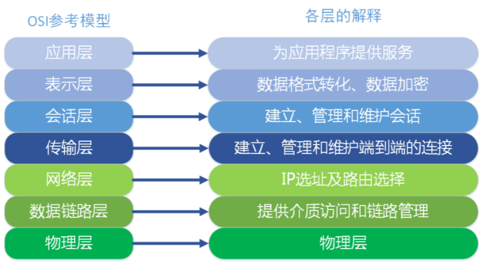
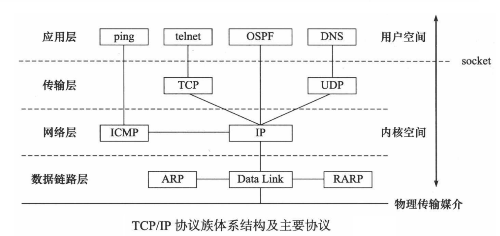
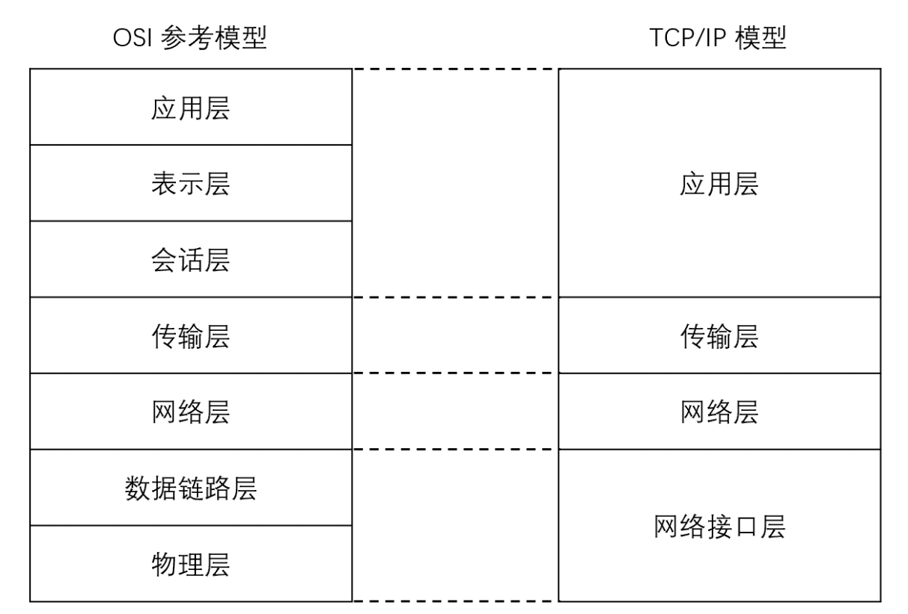
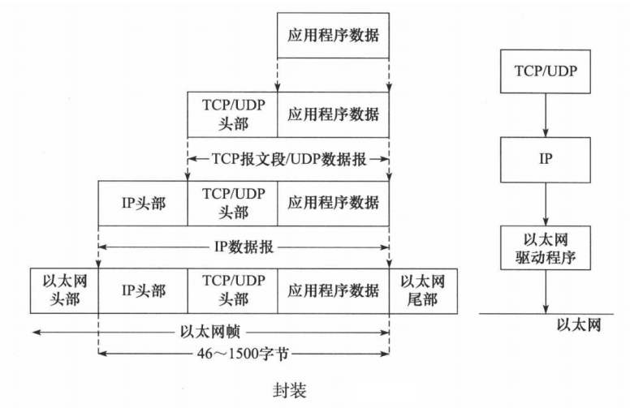
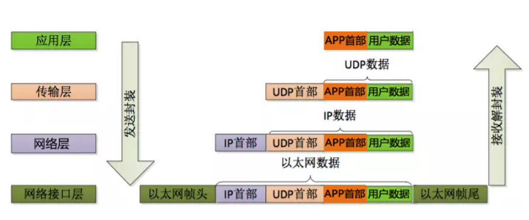

# Notes of Network Programming

## MAC 地址

网卡是一块被设计用来允许计算机在计算机网络上进行通讯的计算机硬件，又称为网络适配器或网络接口卡NIC。其拥有 MAC 地址，属于 OSI 模型的第 2 层，它使得用户可以通过电缆或无线相互连接。每一个网卡都有一个被称为 MAC 地址的独一无二的 48 位串行号。网卡的主要功能：1.数据的封装与解封装、2.链路管理、3.数据编码与译码。

MAC 地址（Media Access Control Address），直译为媒体存取控制位址，也称为局域网地址、以太网地址、物理地址或硬件地址，它是一个用来确认网络设备位置的位址，由网络设备制造商生产时烧录在网卡中。在 OSI 模型中，**第三层网络层负责 IP 地址**，**第二层数据链路层则负责 MA C位址** 。MAC 地址用于在网络中唯一标识一个网卡，一台设备若有一或多个网卡，则每个网卡都需要并会有一个唯一的 MAC 地址。

MAC 地址的长度为 48 位（6个字节），通常表示为 12 个 16 进制数，如：00-16-EA-AE-3C-40 就是一个MAC 地址，其中前 3 个字节，16 进制数 00-16-EA 代表网络硬件制造商的编号，它由IEEE（电气与电子工程师协会）分配，而后 3 个字节，16进制数 AE-3C-40 代表该制造商所制造的某个网络产品（如网卡）的系列号。只要不更改自己的 MAC 地址，MAC 地址在世界是唯一的。形象地说，MAC 地址就如同身份证上的身份证号码，具有唯一性。

## IP 地址

IP 地址（Internet Protocol Address）是指互联网协议地址，又译为网际协议地址。IP 地址是 IP 协议提供的一种统一的地址格式，它为互联网上的每一个网络和每一台主机分配一个逻辑地址，以此来屏蔽物理地址的差异。

IP 地址是一个 32 位的二进制数，通常被分割为 4 个“ 8 位二进制数”（也就是 **4 个字节**）。IP 地址通常用“点分十进制”表示成（a.b.c.d）的形式，其中，a,b,c,d都是 0~255 之间的十进制整数。\
例：点分十进IP地址（100.4.5.6），实际上是 32 位二进制数 \
（01100100.00000100.00000101.00000110）。

### IP 地址编址方式

最初设计互联网络时，为了便于寻址以及层次化构造网络，每个 IP 地址包括两个标识码（ID），即网络ID 和主机 ID。同一个物理网络上的所有主机都使用同一个网络 ID，网络上的一个主机（包括网络上工作站，服务器和路由器等）有一个主机 ID 与其对应。Internet 委员会定义了 5 种 IP 地址类型以适合不同容量的网络，即 A 类 ~ E 类。

其中 A、B、C 3类（如下表格）由 InternetNIC 在全球范围内统一分配，D、E 类为特殊地址。

| 类别 | 最大网络数 | IP地址范围 | 单个网段最大主机数 | 私有IP地址范围 |
| :---: | :---:         | :---: | :---: | :---: |
| A   | 126(2^7-2)      | 1.0.0.1- 126.255.255.254 | 16777214 | 10.0.0.0- 10.255.255.255 |
| B   | 16384(2^14)     | 128.0.0.1- 191.255.255.254 | 65534 | 172.16.0.0- 172.31.255.255 |
| C   | 2097152(2^21)   | 192.0.0.1- 223.255.255.254 | 254 | 192.168.0.0- 192.168.255.255 |

### 子网掩码

子网掩码的设定必须遵循一定的规则。与二进制 IP 地址相同，子网掩码由 1 和 0 组成，且 1 和 0 分别连续。子网掩码的长度也是 32 位，左边是网络位，用二进制数字 “1” 表示，1 的数目等于网络位的长度；右边是主机位，用二进制数字 “0” 表示，0 的数目等于主机位的长度。这样做的目的是为了让掩码与 IP 地址做按位与运算时用 0 遮住原主机数，而不改变原网络段数字，而且很容易通过 0 的位数确定子网的主机数（ 2 的主机位数次方 - 2，因为主机号全为 1 时表示该网络广播地址，全为 0 时表示该网络的网络号，这是两个特殊地址）。通过子网掩码，才能表明一台主机所在的子网与其他子网的关系，使网络正常工作。

## 端口

“端口” 是英文 port 的意译，可以认为是设备与外界通讯交流的出口。端口可分为虚拟端口和物理端口，其中虚拟端口指计算机内部或交换机路由器内的端口，不可见，是特指TCP/IP协议中的端口，是逻辑意义上的端口。例如计算机中的 80 端口、21 端口、23 端口等。物理端口又称为接口，是可见端口，计算机背板的 RJ45 网口，交换机路由器集线器等 RJ45 端口。电话使用 RJ11 插口也属于物理端口的范畴。

## 网络模型

### OSI 七层模型

> 七层模型，亦称 OSI（Open System Interconnection）参考模型，即开放式系统互联。参考模型是国际标准化组织（ISO）制定的一个用于计算机或通信系统间互联的标准体系，一般称为 OSI 参考模型或七层模型。\
它是一个七层的、抽象的模型体，不仅包括一系列抽象的术语或概念，也包括具体的协议。

1. **物理层**：主要定义物理设备标准，如网线的接口类型、光纤的接口类型、各种传输介质的传输速率等。它的主要作用是传输比特流（就是由1、0转化为电流强弱来进行传输，到达目的地后再转化为 1、0，也就是我们常说的数模转换与模数转换）。这一层的数据叫做比特。
2. **数据链路层**：建立逻辑连接、进行硬件地址寻址、差错校验等功能。定义了如何让格式化数据以帧为单位进行传输，以及如何让控制对物理介质的访问。将比特组合成字节进而组合成帧，用MAC地址访问介质。
3. **网络层**：进行逻辑地址寻址，在位于不同地理位置的网络中的两个主机系统之间提供连接和路径选择。Internet的发展使得从世界各站点访问信息的用户数大大增加，而网络层正是管理这种连接的层。
4. **传输层**：定义了一些传输数据的协议和端口号（ WWW 端口 80 等），如：TCP（传输控制协议，传输效率低，可靠性强，用于传输可靠性要求高，数据量大的数据），UDP（用户数据报协议，与TCP 特性恰恰相反，用于传输可靠性要求不高，数据量小的数据，如 QQ 聊天数据就是通过这种方式传输的）。 主要是将从下层接收的数据进行分段和传输，到达目的地址后再进行重组。常常把这一层数据叫做段。
5. **会话层**：通过传输层（端口号：传输端口与接收端口）建立数据传输的通路。主要在你的系统之间发起会话或者接受会话请求。
6. **表示层**：数据的表示、安全、压缩。主要是进行对接收的数据进行解释、加密与解密、压缩与解压缩等（也就是把计算机能够识别的东西转换成人能够能识别的东西（如图片、声音等）。
7. **应用层**：网络服务与最终用户的一个接口。这一层为用户的应用程序（例如电子邮件、文件传输和终端仿真）提供网络服务。

### TCP/IP 四层模型

> 现在 Internet（因特网）使用的主流协议族是 TCP/IP 协议族，它是一个分层、多协议的通信体系。TCP/IP协议族是一个四层协议系统，自底而上分别是数据链路层、网络层、传输层和应用层。每一层完成不同的功能，且通过若干协议来实现，上层协议使用下层协议提供的服务。

TCP/IP 协议在一定程度上参考了 OSI 的体系结构。OSI 模型共有七层，从下到上分别是物理层、数据链路层、网络层、传输层、会话层、表示层和应用层。但是这显然是有些复杂的，所以在 TCP/IP 协议中，它们被简化为了四个层次。

（1）应用层、表示层、会话层三个层次提供的服务相差不是很大，所以在 TCP/IP 协议中，它们被合并为应用层一个层次。

（2）由于传输层和网络层在网络协议中的地位十分重要，所以在 TCP/IP 协议中它们被作为独立的两个层次。

（3）因为数据链路层和物理层的内容相差不多，所以在 TCP/IP 协议中它们被归并在网络接口层一个层次里。只有四层体系结构的 TCP/IP 协议，与有七层体系结构的 OSI 相比要简单了不少，也正是这样，TCP/IP 协议在实际的应用中效率更高，成本更低。

#### 四层介绍

1. 应用层：应用层是 TCP/IP 协议的第一层，是直接为应用进程提供服务的。
（1）对不同种类的应用程序它们会根据自己的需要来使用应用层的不同协议，邮件传输应用使用了 SMTP 协议、万维网应用使用了 HTTP 协议、远程登录服务应用使用了有 TELNET 协议。
（2）应用层还能加密、解密、格式化数据。
（3）应用层可以建立或解除与其他节点的联系，这样可以充分节省网络资源。
2. 传输层：作为 TCP/IP 协议的第二层，运输层在整个 TCP/IP 协议中起到了中流砥柱的作用。且在运输层中， TCP 和 UDP 也同样起到了中流砥柱的作用。
3. 网络层：网络层在 TCP/IP 协议中的位于第三层。在 TCP/IP 协议中网络层可以进行网络连接的建立和终止以及 IP 地址的寻找等功能。
4. 网络接口层：在 TCP/IP 协议中，网络接口层位于第四层。由于网络接口层兼并了物理层和数据链路层所以，网络接口层既是传输数据的物理媒介，也可以为网络层提供一条准确无误的线路。

## 协议

- 应用层常见的协议有：FTP协议（File Transfer Protocol 文件传输协议）、HTTP协议（Hyper Text Transfer Protocol 超文本传输协议）、NFS（Network File System 网络文件系统）。
- 传输层常见协议有：TCP协议（Transmission Control Protocol 传输控制协议）、UDP协议（User Datagram Protocol 用户数据报协议）。
- 网络层常见协议有：IP 协议（Internet Protocol 因特网互联协议）、ICMP 协议（Internet Control Message Protocol 因特网控制报文协议）、IGMP 协议（Internet Group Management Protocol 因特网组管理协议）。
- 网络接口层常见协议有：ARP协议（Address Resolution Protocol 地址解析协议）、RARP协议（Reverse Address Resolution Protocol 反向地址解析协议）。

### UDP 协议

### TCP 协议

### IP 协议

### 以太网帧协议

### ARP协议

### 封装

上层协议是如何使用下层协议提供的服务的呢？其实这是通过封装（encapsulation）实现的。应用程序数据在发送到物理网络上之前，将沿着协议栈从上往下依次传递。每层协议都将在上层数据的基础上加上自己的头部信息（有时还包括尾部信息），以实现该层的功能，这个过程就称为封装。

当帧到达目的主机时，将沿着协议栈自底向上依次传递。各层协议依次处理帧中本层负责的头部数据，以获取所需的信息，并最终将处理后的帧交给目标应用程序。这个过程称为分用（demultiplexing）。分用是依靠头部信息中的类型字段实现的。

## socket、IP地址转换（字符串ip-整数 ，主机、网络字节序的转换）、TCP通信流程、套接字函数、TCP 三次握手、TCP 滑动窗口、TCP 四次挥手、TCP 状态转换、端口复用

见 [socket通信基础](./Socket/socket%E9%80%9A%E4%BF%A1%E5%9F%BA%E7%A1%80.pdf)

## [IO 多路复用](./IO_Multiplexing/IO%E5%A4%9A%E8%B7%AF%E5%A4%8D%E7%94%A8.pdf)

## [UDP 通信](./UDP/UDP%E9%80%9A%E4%BF%A1%E3%80%81%E6%9C%AC%E5%9C%B0%E5%A5%97%E6%8E%A5%E5%AD%97.pdf)
